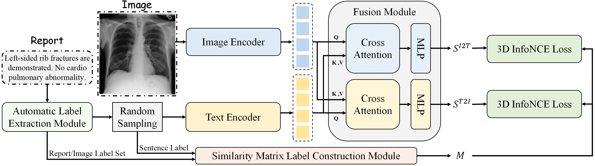

# MICCAI 2025: Medical Contrastive Learning of Positive and Negative Mentions

This repository contains the official code for **Medical Contrastive Learning of Positive and Negative Mentions**. VECL (Visual Entailment based Contrastive Learning) uses positive and negative mentions in radiology reports to build entailment, neutral, and contradiction relationships for medical vision-language pretraining.

Resources:

- Paper: https://papers.miccai.org/miccai-2025/0544-Paper3892.html
- Code: https://github.com/WVeLong/VECL

## Highlights

- Medical vision-language pretraining with positive and negative mention labels.
- Zero-shot classification with POS and PNC evaluation.
- Fine-tuning classification, zero-shot grounding, and retrieval-based report generation entrypoints.
- Public dataset metadata and prompts are included where possible; original medical images must be downloaded from the official dataset providers.



## Datasets

The repository includes lightweight metadata, prompts, labels, and splits under `Dataset/`. It does **not** redistribute raw medical images. Download the original images/reports from the official sources and point the environment variables below to your local copies.

| Dataset | Used for | Official link |
| --- | --- | --- |
| MIMIC-CXR / MIMIC-CXR-JPG | pretraining, retrieval-based report generation | https://physionet.org/content/mimic-cxr/ and https://physionet.org/content/mimic-cxr-jpg/ |
| Open-I / IU X-Ray | zero-shot and fine-tuning classification | https://openi.nlm.nih.gov/faq |
| CheXpert | zero-shot and fine-tuning classification | https://stanfordmlgroup.github.io/competitions/chexpert/ |
| ChestXray14 | zero-shot and fine-tuning classification | https://nihcc.app.box.com/v/ChestXray-NIHCC |
| ChestXDet10 | zero-shot classification and grounding | https://github.com/Deepwise-AILab/ChestX-Det10-Dataset |
| PadChest | zero-shot classification | https://bimcv.cipf.es/bimcv-projects/padchest/ |

Large metadata files such as pickle caches are published through GitHub Releases instead of Git history. After downloading a release asset, extract it at the repository root so the files land back under `Dataset/`.

## Installation

```bash
git clone https://github.com/WVeLong/VECL.git
cd VECL
conda env create -f environment.yml
conda activate VECL
```

The original experiments used Python 3.8, PyTorch 1.12.1, CUDA 11.3, and an 80GB A800 GPU. `requirements-freeze.txt` records the original server environment for reference; use `environment.yml` for a cleaner install.

Download the external pretrained components:

- M3AE ViT-B/16 checkpoint: place it at `pretrain_model/VITB-16-M3AE_last.ckpt`, or set `VECL_M3AE_VITB16`.
- BioClinicalMPBERT: defaults to `Laihaoran/BioClinicalMPBERT`; set `VECL_BIOCLINICAL_BERT` to a local Hugging Face directory for offline use.
- VECL final checkpoint: download the `vecl_miccai_final.ckpt.part-*` files from the GitHub Release, concatenate them into `pretrain_model/vecl_miccai_final.ckpt`, and then set `VECL_FINAL_CKPT` if you place it elsewhere.

## Data and Path Configuration

The code defaults to relative paths under this repository. Override them when your raw images live elsewhere:

```bash
export VECL_PROJECT_ROOT=$PWD
export VECL_DATASET_ROOT=$PWD/Dataset
export VECL_MODEL_ROOT=$PWD/pretrain_model
export VECL_OUTPUT_DIR=$PWD/data/output
export VECL_FINAL_CKPT=$PWD/pretrain_model/vecl_miccai_final.ckpt

export VECL_OPENI_ROOT=/path/to/Open-I/images
export VECL_CHEXPERT_ROOT=/path/to/CheXpert
export VECL_CHESTXRAY14_ROOT=/path/to/ChestXray14/images
export VECL_CHESTXDET10_ROOT=/path/to/ChestXDet10
export VECL_PADCHEST_ROOT=/path/to/PadChest/images
export VECL_MIMIC_CXR_JPG_ROOT=/path/to/mimic-cxr-jpg/2.0.0
```

If your server needs a proxy for external downloads, for example Hugging Face or GitHub, export one of:

```bash
export http_proxy=http://10.0.0.204:1090
export https_proxy=http://10.0.0.204:1090
# or, if needed:
export http_proxy=http://10.0.0.204:1080
export https_proxy=http://10.0.0.204:1080
```

## Usage

### Pretraining

```bash
bash finetune.sh
```

or explicitly:

```bash
python run.py --config configs/pretrain.yaml --train --train_pct 1.0
```

### Zero-shot classification

`EVALUATION_METHOD` can be `POS` or `PNC`. `TEST_DATASETS` uses indices `0=Open-I, 1=CheXpert, 2=ChestXray14, 3=ChestXDet10, 4=PadChest`.

```bash
EVALUATION_METHOD=PNC TEST_DATASETS=0,1,2,3,4 bash downstream/zeroshot/inference.sh
```

### Fine-tuning classification

```bash
python run.py --config configs/ChestXray14_classification_config.yaml --train --train_pct 0.1
```

Evaluate fine-tuned checkpoints:

```bash
CKPT_DIR=data/ckpt/VECL_finetune_classification \
CFG_PATH=configs/ChestXray14_classification_config.yaml \
DATASET_NAME=ChestXray14 TRAIN_PCT=0.1 EVALUATION_METHOD=POS \
bash downstream/finetune/inference_finetune.sh
```

### Zero-shot grounding

```bash
python downstream/grounding/grounding.py --ckpt_path "$VECL_FINAL_CKPT"
```

### Retrieval-based report generation

Run inference for each split, then post-process:

```bash
for split in 1 2 3 4; do
  SPLIT_ID=$split NUM_CHUNKS=4 bash downstream/retrieval/retrieval_inference.sh
done
NUM_CHUNKS=4 bash downstream/retrieval/retrieval_post_process.sh
```

## Model Zoo

| File | Purpose | Distribution |
| --- | --- | --- |
| `vecl_miccai_final.ckpt` | final VECL pretraining checkpoint used for downstream evaluation | GitHub Release asset |
| `VITB-16-M3AE_last.ckpt` | external M3AE ViT-B/16 image encoder initialization | external download |
| BioClinicalMPBERT | text encoder/tokenizer | Hugging Face or local cache |

The final checkpoint is selected by comparing candidate checkpoints against the MICCAI paper metrics. The checkpoint is split into Release assets named `vecl_miccai_final.ckpt.part-*`; concatenate them in lexical order to restore `vecl_miccai_final.ckpt`. See `checkpoint_manifest.json` in the Release assets for sha256, source path, and verification notes.

## Paper Results

The paper compares VECL with representative medical vision-language baselines including MedCLIP, GLoRIA, MedKLIP, KAD, and CARZero. The key results below focus on the main comparisons; ablation studies are omitted here for readability.

### Zero-shot classification

VECL is evaluated with both Positive-Only Similarity (POS) and Positive-Negative Similarity (PNC). The table reports VECL against the strongest baseline score for each dataset/metric from Table 1.

| Evaluation | Dataset | Best baseline AUC/F1 | VECL AUC/F1 |
| --- | --- | --- | --- |
| POS | Open-I | 0.839 / 0.283 | **0.839 / 0.341** |
| POS | CheXpert5 | 0.909 / 0.549 | **0.915 / 0.664** |
| POS | ChestXray14 | 0.803 / 0.289 | **0.816 / 0.309** |
| POS | ChestXDet10 | 0.795 / 0.449 | **0.811 / 0.498** |
| POS | PadChest | 0.804 / 0.114 | **0.822 / 0.147** |
| PNC | Open-I | 0.756 / 0.184 | **0.813 / 0.333** |
| PNC | CheXpert5 | 0.819 / 0.531 | **0.922 / 0.689** |
| PNC | ChestXray14 | 0.704 / 0.180 | **0.792 / 0.291** |
| PNC | ChestXDet10 | 0.675 / 0.383 | **0.780 / 0.470** |
| PNC | PadChest | 0.700 / 0.051 | **0.775 / 0.116** |

### Fine-tuning classification

On ChestXray14, VECL improves low-data fine-tuning performance over KAD and CARZero.

| Training data | Best baseline AUC/F1 | VECL AUC/F1 |
| --- | --- | --- |
| 1% | 0.813 / 0.153 | **0.826 / 0.338** |
| 5% | 0.835 / 0.189 | **0.842 / 0.352** |
| 10% | 0.839 / 0.196 | **0.845 / 0.361** |

### Grounding and report generation

| Method | ChestXDet10 Pointing Game | MIMIC-CXR RG-L | BL-1 | BL-2 | CIDEr | CE Precision | CE Recall | CE F1 |
| --- | --- | --- | --- | --- | --- | --- | --- | --- |
| KAD | 0.391 | 0.115 | 0.189 | 0.087 | 0.019 | 0.504 | 0.137 | 0.197 |
| CARZero | 0.543 | 0.128 | 0.223 | 0.105 | 0.028 | 0.496 | 0.160 | 0.218 |
| VECL | **0.683** | **0.128** | **0.223** | **0.105** | **0.029** | **0.574** | **0.204** | **0.273** |

### Conclusion

VECL addresses the mismatch between general-domain contrastive learning and medical reports, where negative mentions are common and clinically meaningful. By modeling entailment, neutral, and contradiction relationships between images and report sentences, VECL improves multimodal alignment and achieves strong results across zero-shot classification, low-data fine-tuning, zero-shot grounding, and retrieval-based report generation.

Please cite the paper if you use this code.

```bibtex
@InProceedings{WuWei_Medical_MICCAI2025,
  title={Medical Contrastive Learning of Positive and Negative Mentions},
  author={Wu, WeiLong and Yang, Jingzhi and Zhu, Xun and Zhang, Xiao and Liu, ZiYu and Li, Miao and Wu, Ji},
  booktitle={Proceedings of Medical Image Computing and Computer Assisted Intervention -- MICCAI 2025},
  year={2025},
  publisher={Springer Nature Switzerland},
  volume={LNCS 15970},
  pages={392--401}
}
```

## License

This project is released under the MIT License.

Restore split checkpoint on Linux/macOS:

```bash
cat vecl_miccai_final.ckpt.part-* > pretrain_model/vecl_miccai_final.ckpt
sha256sum pretrain_model/vecl_miccai_final.ckpt
```

Restore split checkpoint on Windows PowerShell:

```powershell
Get-Content .\vecl_miccai_final.ckpt.part-* -AsByteStream -Raw | Set-Content .\pretrain_model\vecl_miccai_final.ckpt -AsByteStream
Get-FileHash .\pretrain_model\vecl_miccai_final.ckpt -Algorithm SHA256
```
